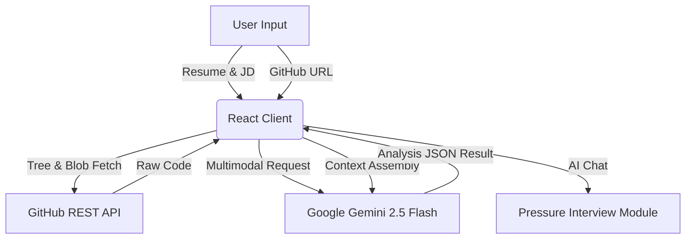

# ⭐ FactCheck AI

> 자소서나 이력서의 주장, GitHub 코드, 채용공고(JD)를 AI가 교차 분석하여<br>
> 지원자의 기술 신뢰도·일관성·실제 실력을 검증하고<br>
> 개인 맞춤형 압박 면접 시뮬레이션을 제공하는 서비스입니다.<br>


# ✨ Features

### 🔍 3-Way Cross Verification

* Resume / Cover Letter
* GitHub Repository
* Job Description (URL · 텍스트 · 이미지 · PDF)
  세 요소를 증거 기반으로 교차 검증합니다.

### 🧠 6-Factor AI Evaluation

* Architecture
* Code Quality
* Consistency (주장 vs 코드)
* Problem Solving
* Tech Proficiency
* Project Completeness

### 🧩 Python/ML Repository Deep Analysis

* PyTorch / TensorFlow 모델 구조
* 학습 루프 / Forward Pass
* Dataset & DataLoader
* Hyperparameter 흔적 분석

### 📄 Multimodal JD Parsing

* 텍스트 / 이미지(JPG, PNG) / PDF / URL
* OCR 기반 텍스트 추출
* JD 구조 자동 재구성

### 💬 AI 압박 면접 (Live Interview Mode)

* 레벨별 질문(Intern ~ 5년차)
* 꼬리 질문 / 추궁 질문
* 답변 회피 감지 → 감점 및 재질문
* 시간 제한(Timer) 기능

### 🌓 Dark / Light Mode

* 화면 우측 하단 플로팅 버튼
* LocalStorage 기반 모드 저장
* 전체 UI 실시간 반영

# 📸 Demo

(GIF 또는 이미지 추가 예정)


# 🏗️ Architecture

FactCheck AI는 클라이언트 사이드 논블록킹 아키텍처이며
GitHub API와 Gemini LLM을 직접 연동하여 실시간 분석을 수행합니다.



# 🛠️ Tech Stack

| Category         | Technologies                                      |
| ---------------- | ------------------------------------------------- |
| Frontend         | React 19, TypeScript, Vite                        |
| Styling          | Tailwind CSS, Heroicons                           |
| AI / LLM         | Google Gemini 2.5 Flash (`@google/generative-ai`) |
| Data Fetching    | GitHub REST API                                   |
| Parsing          | PDF/Image → Base64 Multimodal Parsing             |
| State Management | React Context API (Theme), Local State            |
| Architecture     | Non-blocking Client-Side SPA                      |

# 🚀 How to Use

1. 환경 설정

   * 면접 레벨(Intern~Senior)
   * 답변 제한시간 설정

2. JD 입력

   * 텍스트
   * URL
   * PDF/이미지 업로드

3. 이력서/자소서 입력

4. GitHub Repository 주소 입력

5. 분석 실행

   * 교차 검증
   * 코드 기반 증거 수집
   * 6-Factor 분석 리포트 생성

6. AI 면접 진행

   * 약점 기반 압박 질문
   * 꼬리 질문
   * 시간 제한 모드

7. 최종 피드백 리포트 확인

   * Logic / Honesty / Solution 스코어
   * 개선을 위한 액션 아이템 제공

# 💡 Detailed Features

### 1. 6-Factor Technical Scoring

* 설계 패턴 정합성
* 테스트 코드 존재 여부
* 코드 구조 안정성
* 예외 처리 수준
* 자소서 주장 대비 코드 일치도
* 문서화/README 품질

### 2. ML/Research Repository Deep Dive

* Vision Transformer 등 복잡한 모델도 분석
* Forward Pass 추적
* Loss/Optimizer 구성 분석
* Custom Dataset 로직 확인

### 3. Adaptive Persona Interview

* 테마에 따라 면접관 어조 변화
* 불명확한 답변 → 감점 및 재질문
* 침묵 시 “처음이라 그래요. 괜찮아요.” 출력

# 📂 Project Structure

```bash
factcheck-ai/
├── public/
├── src/
│   ├── components/
│   │   ├── AnalysisResult.tsx
│   │   ├── Header.tsx
│   │   ├── InputForm.tsx
│   │   ├── InterviewChat.tsx
│   │   └── InterviewFeedback.tsx
│   ├── context/
│   │   └── ThemeContext.tsx
│   ├── services/
│   │   ├── geminiService.ts
│   │   └── githubService.ts
│   ├── App.tsx
│   ├── index.tsx
│   └── types.ts
├── index.html
├── metadata.json
├── package.json
└── tailwind.config.js
```
